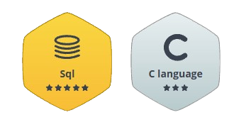

<h1 align="center">Hi 👋, I'm Rekha H Rathore</h1>

<h3 align="center">
💻 Software Developer | B.Tech CSE Student | Aspiring Full Stack Developer
</h3>

---

# 👩‍💻 About Me

🎓 B.Tech Computer Science Engineering Student passionate about building impactful software solutions.

💻 Interested in **Software Development, Full Stack Web Development, and Problem Solving.**

🚀 I enjoy developing modern web applications and continuously learning new technologies.

🌱 Currently learning **React.js, Node.js, Express.js, MongoDB, and Data Structures & Algorithms.**

🤝 Always excited to collaborate on innovative projects and contribute to Open Source.

---

# 💼 Experience

## 💻 Software Engineer Intern
**Uno Minda**

- Worked as a Software Engineer Intern in the SAP Applications team.
- Gained exposure to enterprise software development and development workflows.
- Collaborated with team members to understand software development practices.
- Improved debugging, analytical, and problem-solving skills.

---

## 🎨 UI/UX Design Intern
**SkillCraft Technology** *(Remote)*

- Designed responsive user interfaces and wireframes using Figma.
- Worked on user research, prototyping, and UI improvements.
- Focused on creating intuitive and user-friendly experiences.

---

# 🏅 Coding Profiles

---

# 🏆 HackerRank Achievements

⭐ SQL — <b>5 Stars</b> 
⭐ C Language — <b>3 Stars</b>

---

# 🛠 Tech Stack

### 💻 Languages

### 🌐 Frontend

### ⚙️ Backend

### 🗄️ Database

### 🧰 Tools

---

# 🚀 Featured Projects

| Project | Description | Tech Stack |
|----------|-------------|------------|
| 📸 Instagram Clone | Full Stack social media platform with authentication, posts, reels, likes, comments and follow system | React • Node.js • MongoDB |
| 🌐 Portfolio Website | Personal portfolio showcasing projects, skills, and experience | React |
| 🤖 AI Chatbot | Java-based chatbot application | Java |
| 🎓 Student Grade Tracker | Java desktop application for managing student records | Java |

---
# 📫 Connect With Me

📧 **Email:** **rathorerekha052@gmail.com**

🌐 **Portfolio:** https://portfolio-murex-iota-10.vercel.app

💼 **LinkedIn:** https://www.linkedin.com/in/rekha-h-rathore-284807324

🏅 **HackerRank:** YOUR_HACKERRANK_PROFILE_LINK

📷 **Instagram:** https://instagram.com/rekha__.06

---

# 💜 Favorite Quote

> *"Consistency beats talent when talent doesn't stay consistent."*

---

## ✨ Thanks for Visiting My Profile!

### 💜 Code • Learn • Build • Repeat 🚀

